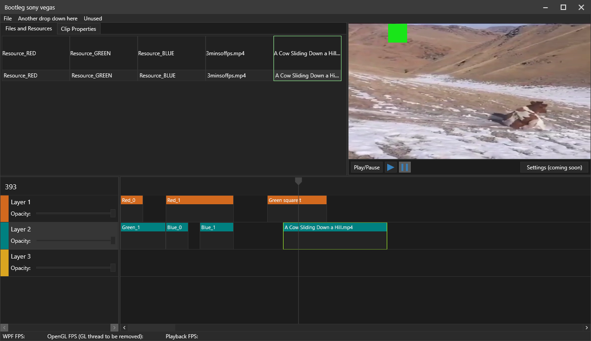

# FramePFX
A small video editor

I started making this because other editors like vegas, prmiere pro, etc, just seem to run so slowly 
and some of them just lack basic features (e.g zoom in the view port with CTRL + MouseWheel)

I doubt this will ever even come close to those editors... but hopefully this will at least support "editing" videos, even if it's just cutting up clips

I'm still using the old deprecated functions because i was lazy lol... I may try and convert it to using shaders, VBOs, etc, at some point

I also don't know if it's a good idea for the ViewModels (e.g SquareClipViewModel) to have access to OpenGL and to be primarily responsible for rendering... but i'm not sure how else to do it

# Preview

## Rendering
Rendering the main view port (and soon the clip/text resource previews) is done with OpenGL. I made another git repo showing the minimum amount of code to render OpenGL in WPF using nothing but OpenTK (but with this app i came up with a new way of rendering though, and this way seems to be faster in general but possibly more unsafe and may result in visual glitches when rendering occours very quickly... maybe)

Basically, OpenGL is just rendering into a framebuffer, and then copying the framebuffer pixels to a WritableBitmap's BackBuffer (all on another thread). The BackBuffer can be access even if the bitmap isn't locked, but you need to store the bitmap BackBuffer pointer as a field to access it off the WPF thread

Then, you just create a DispatcherTimer to Lock, Mark the dirty region and then unlock, which lets WPF render. This means you can draw OpenGL and copy that into the pointer, and render the WPF side at the same time

## Resource list
`ResourceListControl` and `ResourceItemControl` are an example of how to implement multi-selection, drag dropping, and also shift-selection (to select a range of items)

Oh and uh... don't drag drop something like your C:\ drive or a folder which contains 100,000s of files in the hierarchy into the ResourceListControl, otherwise the app will probably freeze as it recursively loads all of those files

# Rendering/Encoding
TODO... but it won't modify the UI at all, in order to help render times. It will probably just setup a view port based on the render output resolution,
draw the clips each frame, and then copy the pixels from OpenGL to an encoder. Maybe FFMPEG?

## Downloading/Running
To run this, you just need to download this repo and also the ffmpeg's shared x64 libraries (https://github.com/BtbN/FFmpeg-Builds/releases/tag/latest, specifically  https://github.com/BtbN/FFmpeg-Builds/releases/download/latest/ffmpeg-master-latest-win64-gpl-shared.zip). You place all of the files in the bin folder (apart from the ffmpeg exes) into the bin folder of this project (FramePFX/Bin/Debug or Release depending on how you compiled it)

And to drag videos into the editor, you drag and drop a video file to the top left "resource manager", and then drag one of those items into the timeline. Will soon support directly dropping a clip into the timeline

