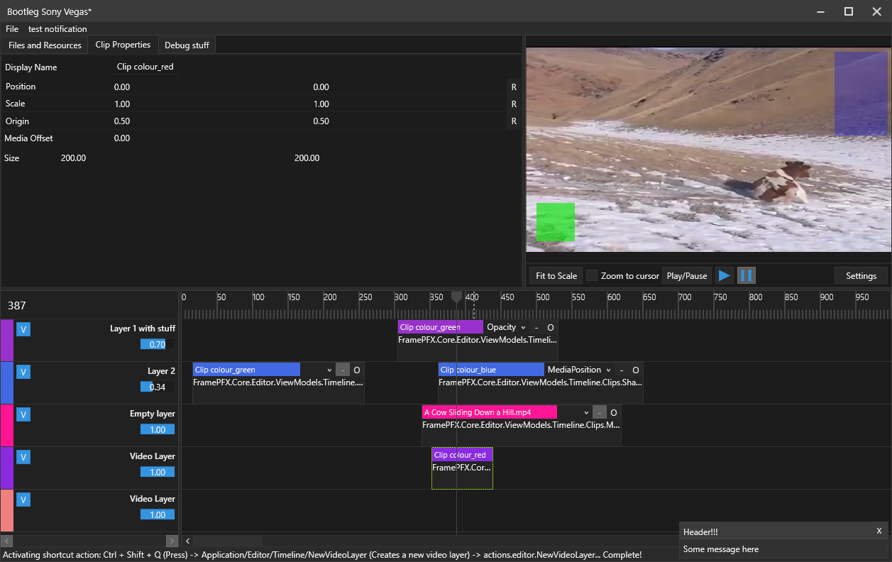

# FramePFX
A small video editor

I started making this because other editors like vegas, premiere pro, etc, just seem to run so slowly 
and some of them just lack basic features (e.g zoom in the view port with CTRL + MouseWheel)

I doubt this will ever even come close to those editors... but hopefully this will at least support "editing" videos, even if it's just cutting up clips

# Preview

## ViewModels/Models
I tried to wrap all models with view models so that the app could still function moderately well even if it had no view models or even UI, simiular to how OBS can run without the front-end entirely... not that you'd want to but anyway. 

View models still take a lot of big responsibilities of the models though (e.g. firing the model events when view model properties change in order to force a re-render), and it also opens up the possibility for viewmodel and model desynchronisation (especially when it comes to synchronising VM observable collections and model lists) which hopefully won't happen

## Automation/animation
Always found automating parameters in the popular editors to be generally finicky. Ableton Live has a really good automation editor though, so I plan to mimic that. My plan is:
- each clip has it's own keyframe/envolope editor that stretches the entirety of the clip. 
- Layers would have the same, but it stretches the entire timeline. 
- Automating project settings, or anything else really, could be done on an automation-specific layer (allowing for more than just video/audio layers)

### Here's a demo of video layer opacity automation (very WIP; can only move these 3 points currently)

The automation/parameter selector it on the top right of the clip (in its header). The O button toggles an override, which disables automation, and the other one towards the left clears the current selection

## Rendering
Rendering the main view port (and soon the clip/text resource previews) is done with SkiaSharp. Originally was done with OpenGL (using OpenTK) but SkiaSharp is much simpler to use (easy image loading, not sure about video yet though, easy texture drawing, etc)

## Resource list
`ResourceListControl` and `ResourceItemControl` are an example of how to implement multi-selection, drag dropping, and also shift-selection (to select a range of items)

Oh and uh... don't drag drop something like your C:\ drive or a folder which contains 100,000s of files in the hierarchy into the ResourceListControl, otherwise the app will probably freeze as it recursively loads all of those files

# Rendering/Encoding
I still have yet to implment exporting videos as I'm new to the whole video encoding/decoding world. But the entire project draws the "preview" viewport at full resolution anyway so you can just pass that directly to FFmpeg somehow I guess

## Downloading/Running
To run this, you just need to download this repo and also the ffmpeg's shared x64 libraries (https://github.com/BtbN/FFmpeg-Builds/releases/tag/latest, specifically https://github.com/BtbN/FFmpeg-Builds/releases/download/latest/ffmpeg-master-latest-win64-gpl-shared.zip). You place all of the files in the bin folder (apart from the ffmpeg exes) into the bin folder of this project (FramePFX/Bin/Debug or Release depending on how you compiled it) and it should compile fine. It's using .NET Framework 4.7.1 and .NET Standard 2.0

And to drag videos into the editor, you drag and drop a video file to the top left "resource manager", and then drag one of those items into the timeline. Will soon support directly dropping a clip into the timeline

## Cross platform
Currently there's only a WPF implementation, but I hope to switch to avalonia at some point or MAUI. Most of the classes are implented in the .NET Standard project, so it's relatively easy to port the app over to different platforms, but then there's also SkiaSharp, FFmpeg, etc, dependencies too...

## BUGS ono
If you drag a video clip (with a video from a file) into another layer, it will crash. I think this is because of how i'm handling the transition of clips across layers; it invalidates the clip's resource handle, which could (at some point) be disposing of parts of the resource object by accident? (clips are not supposed to dispose resources... yet)

