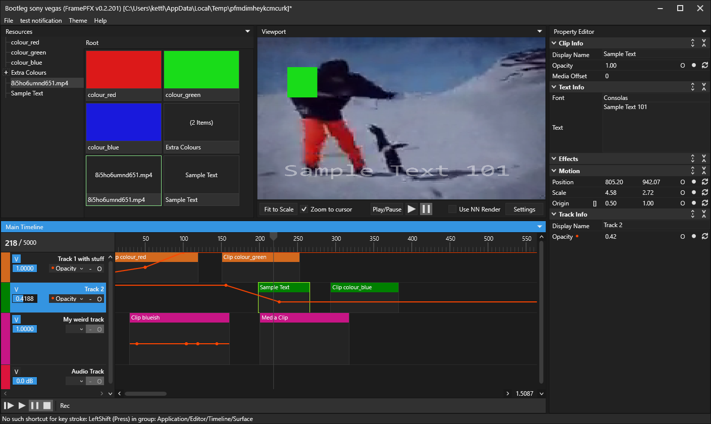
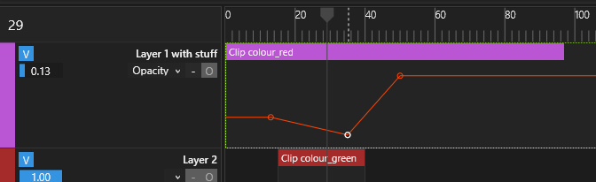
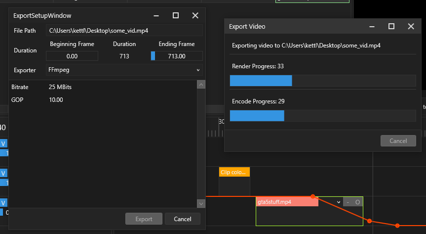

# !! Code will be replaced soon !!
I decided to mostly abandon the MVVM side of this editor because it makes adding/changing things way harder due to me trying way to hard to 
stick to pure MVVM. But instead of re-working this repo, I decided to create a new one at https://github.com/AngryCarrot789/FramePFXNewFrameworkTests.

Once I get all features in this repo implemented in that new one, I'll copy over all the code from that one to here, deleting the MVVM side entirely (though it will still be accessible through github push history).

From there, I hope to maybe try and reimplement some of the MVVM things if it isn't too much of a burden and doesn't require creating replicates of the editor, project, timeline, track, clip and effect clases as view models versions  

# FramePFX
A small (non-linear) video editor, written in C# using WPF/MVVM

I mainly started this as a learning tool into the world of video/audio processing (all I really knew before this was basic OpenGL drawing), but also because other editors like vegas, premiere pro, hitfilm, etc, just seem to run so slowly and some of them just lack basic features (e.g zoom in the view port with CTRL + MouseWheel)

I doubt this will ever even come close to those editors, but hopefully it will at least support some basic editing

If you have any feedback/criticism for the app, that would be appreciate! Also feel free to contribute, if you would like to. You can see the TODO list near the bottom

# Preview
There are 6 themes. This is the `Soft Dark` theme. But there's also `Deep dark`, `Dark Grey`, `Grey`, `Red and Black` and a really bad `Light Theme` that makes discord's light theme look good

### Automation/animation
Always found automating parameters in the popular editors to be generally finicky. Ableton Live has a really good automation editor though, so I took a fair bit of inspiration from it:
- Each clip has it's own keyframe/envelope editor that stretches the entirety of the clip. 
- Tracks have the same, but it stretches the entire timeline. 
- Automating project settings, or anything else really, will soon be do-able on a timeline automation specific track (allowing for more than just video/audio tracks)

#### Demo of video track opacity automation
The automation/parameter selector for tracks is on the right side of the thingy on the left. For clips, select a clip and the selectors show on the right side (in its header). The "O" button toggles an override, which disables automation, and the "-" button clears the current selection. 

The "Rec" button above the timeline on the left starts recoding every parameter (similar to the feature in Cinema4D. This screen shot is old so it doesn't show the button); modify anything like scale or opacity and it inserts a key frame

### Encoding/Exporting
Click "Export" in the file menu at the top left, and you can specify some render details. Currently, only .mp4 aka MPEG-4 aka h.264 is supported. Might try to implement more soon. The output cannot be scaled at the moment. A timeline frame is rendered, then that BGRA frame is converted to YUV, then encoded, then written to file (encoding and writing aren't necessarily in the same order; encoding takes some time)

# Backend stuff

### ViewModels/Models 
I tried to wrap all models with view models so that the app can still function even if it had no view models or even UI, 
similar to how OBS can run without the front-end entirely, not that you'd want to...

View models still take a good few big responsibilities of the models though, such as firing the model events when view model properties change in order to force a re-render, or the resource view models being the only thing that can "Load" the resource model, due to the ResourceCheckerViewModel being used (it seems weird to pass the resource checker to a model since the checker is a view model)

### Rendering
Rendering is done with SkiaSharp for simplicity, using OpenGL as a backend (may switch to software rendering if there's any problems). 

The `Timeline` class handles the rendering. `BeginCompositeRender` iterates the tracks and the clips at the timeline's playhead (bottom to top), adds them to a list, and calls `Clip.OnBeginRender`. Then, `EndCompositeRenderAsync` iterates that list and calls `Clip.OnEndRender` which is where rendering actually occurs (returns a Task so it can be awaited). 

Each clip is rendered synchronously, meaning if a clip's render process is very expensive or `AVMediaVideoClip` is waiting for the decoder to finish decoding a frame, it stalls the entire render process, which is why I really need to get around to implementing multi threaded rendering

I started working on a deferred rendering system (called XCE) which I might start using, although it requires a huge amount of work before it can be used. XCE is similar to WPF's DrawingContext and RenderData classes, where you write render instruction records that can be played back. Using XCE will let me draw on a specific rendering thread, but I'm not sure how much more performant it would be as apposed to just rendering on the main thread

### Resource list
`ResourceListControl` and `ResourceItemControl` are an example of how to implement multi-selection, drag dropping, and also shift-selection (to select a range of items)

The resources are shareable between clips so that clips can obviously share similar details (e.g. same text or font/font size), or same image, same shape colour, etc.

To drag videos, images, etc., into the editor: drag and drop the file to the top left "resource manager", and then drag one of those items into the timeline. Will soon support directly dropping a clip into the timeline

Oh and uh... don't drag drop something like your C:\ drive or a folder which contains 100,000s of files in the hierarchy into the ResourceListControl, otherwise the app will probably freeze as it recursively loads all of those files

# TODO
### Audio
I don't know how to implement audio playback yet, despite my best efforts to try and understand audio playback and how data is requested/delivered at the right times. I found a demo of libsoundio, which is in App.cs at the moment, but that's about it really
### Rendering
- Invalidating the 'render' of the current timeline is messy at the moment. I managed to clean it up a bit, but there's still these 4 options:
    - Schedule automation then schedule render (or render immidiately)
    - Do automation tick and schedule render (or render immidiately)
- I don't feel too good about the render process... OnBeginRender, OnEndRender and OnRenderCompleted feels overcomplicated, even though it offers some convenience (e.g. cleanup resources in OnRenderCompleted), as well as how effects are done. It works though, so :/
- Implement multi-threaded rendering, using things like double buffering and proxy objects to manage the data between main and render threads
### Automation Engine
- Add support for smooth interpolation (e.g. a curve between 2 key frames). I tried doing this, but had a hard time figuring out the math to do the interpolation, and also doing the hit testing for the UI
### Timelines, Tracks
- Add track effects
### Clips
- AVMediaVideoClip is extremely slow for large resolution videos (e.g. 4K takes around 40ms to decode and render onscreen), and only a few video codecs even seem to work. Lots of common file formats give an error like "found invalid data while decoding". I don't know FFmpeg much but I hope to somehow fix this at some point
- Implement fading between 2 clips
### Resources
- Remove ErrorList usage in LoadResource, and replace with some sort of `ExceptionExplorer` that is visible in the resource checker dialog
- Not sure if LoadResource should be moved to the model yet
### General TODO:
- Implement a way to directly map between Models and ViewModels (e.g. Clip->ClipViewModel, ResourceItem->ResourceItemViewModel). At the moment, I do the plain linear search for clips (IndexOf), but for resources, I decided to reference the ViewModel in the Model
- CreateCompositionFromClipsAction's code is quite messy
### History system
- I removed a lot of the undoable/redoable history actions because I was changing the code base all the time, so I will soon try to add back those history actions once I get the code base to an actual usable point

# Compiling
FFmpeg's shared x64 libraries are the only external library (at the moment...). They can be found here: 
https://github.com/BtbN/FFmpeg-Builds/releases/download/latest/ffmpeg-master-latest-win64-gpl-shared.zip

You build the project (debug or release), then place all of the FFmpeg DLL files in the WPF project's bin folder, and then you should be able to run the editor, and debug it if you want. 

The front-end uses .NET Framework 4.8, and the back-end uses .NET Standard 2.0

## Cross platform
Currently there's only a WPF implementation, but I hope to switch to Avalonia at some point or MAUI. Most, if not all, of the important classes are located in the .NET Standard project, so it's relatively easy to port the app over to different platforms. However there's also OpenGL, FFmpeg, and some (unused at the moment) audio library dependencies too...

## BUGS
- Importing certain video files can cause the render to fail (some sort of "found invalid data while decoding" error)
## Licence
Project is licenced under MIT. I'm not a lawyer but, AFAIK, FFmpeg and FFmpeg.AutoGen being licenced primarily under GNU Lesser General Public License allows MIT to be used as long as the FFmpeg source code is not modified (which in this project, it isn't)
