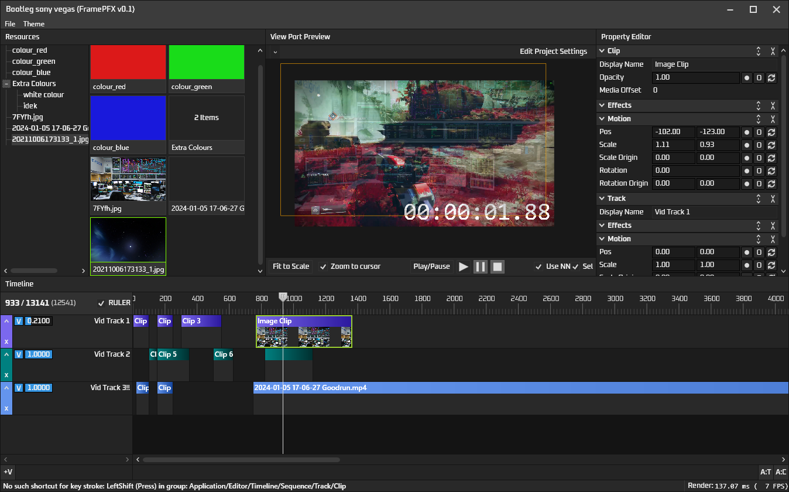
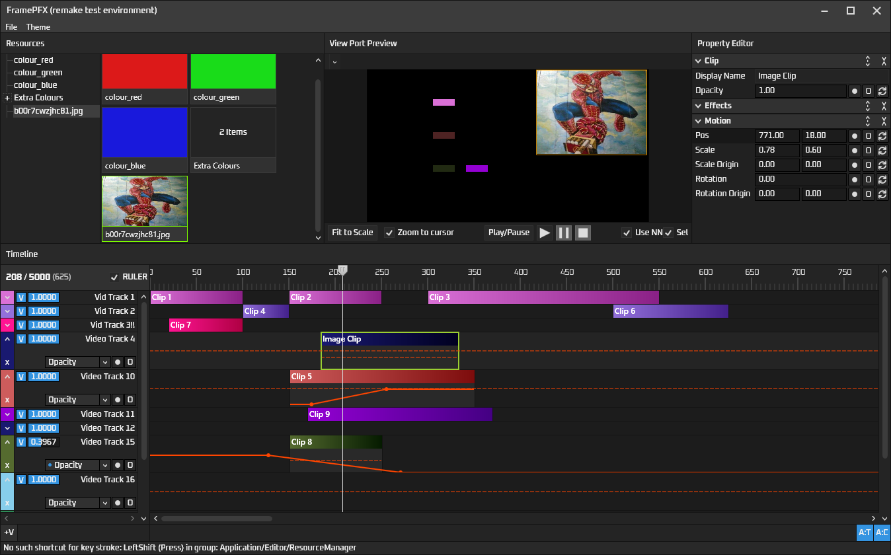
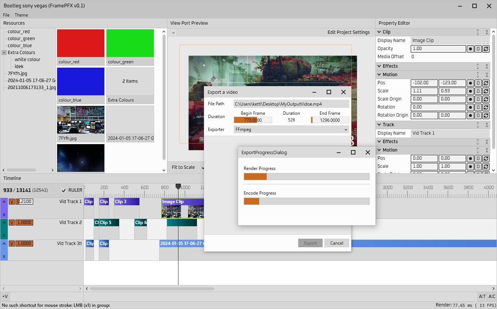

# FramePFX
A small (non-linear) video editor, written in C# using WPF

I mainly started this as a learning tool into the world of video/audio processing (all I really knew before this was basic OpenGL drawing), but also because other editors like vegas, premiere pro, hitfilm, etc, just seem to run so slowly and some of them just lack basic features (e.g zoom in the view port with CTRL + MouseWheel)

I doubt this will ever even come close to those editors, but hopefully it will at least support some basic editing

If you have any feedback/criticism for the app, that would be appreciate! Also feel free to contribute, if you would like to. You can see the TODO list near the bottom

# Preview
There are 6 themes. This is the `Soft Dark` theme. But there's also `Deep dark`, `Dark Grey`, `Grey`, `Red and Black` and a `Light Theme` (if you dare use it)

This is the latest version:

This is a slightly older version showing some automation/animation/keyframe usage:

Here is a preview of the export process. Export button is in File>Export, you specify a path and then click Export. Notice how slow the render is (bottom right corner) :'(. The render uses Skia's highest quality 
filter during export (low for the preview view port), but I will add an option to change that. To cancel the render you just click Cancel on the dialog behind the export progress window

The grey panel below "Exporter: FFmpeg" is encoder-specific details. I haven't added anything yet, but soon I will put things like a bitrate slider in there.

### Automation/animation
Always found automating parameters in the standard editors to be generally finicky. Ableton Live has a really good automation editor though, so I took a fair bit of inspiration from it:
- Each clip has it's own keyframe/envelope editor that stretches the entirety of the clip. Effects also use this
- Tracks have the same, but it stretches the entire timeline. 
- Automating project settings, or anything else really, will soon be do-able on a timeline automation specific track (allowing for more than just video/audio tracks)

The clip's automation sequence editor's target parameter can be changed by selecting a row (I call them "slots") in the property editor. The currently selected slot is what the clip shows (if clip automation is visible, click C to toggle)

# Backend stuff

### Models and the UI

I previously made this using MVVM everywhere, but it made adding new features really difficult, so I decided to rewrite the entire program
and instead go with a mostly non-view-model design, where the models are just the state and the views/controls add and remove event handlers 
to obverse the state of the models.

This turns out to be a lot more performant (which is actually the main reason I switched), somewhat just as easy to add new features, and the 
signals between ViewModel/View are not entirely commands anymore. But it does mean moving this to something like Avalonia (which I haven't thought
of doing yet) would be a lot more difficult.

The editor can run entirely without a front end though, as none of the models contain any UI specific code (except for basic things like a IsSelected
property in the clips, tracks and resources, but they're just booleans)

### Rendering
Rendering uses SkiaSharp (for simplicity) and multiple render threads for speed. The `RenderManager` class handles the render initialisation.

The render phase is like this:
- Something tells the RenderManager that the render state is invalidated and to schedule a render on the app dispatcher
- All timeline tracks processed (bottom to top, as most editors do) to figure out if the track can be rendered (is it visible 
  and a non-zero opacity and are there clips on the playhead that are visible)
- `PrepareRenderFrame` is called on the video tracks, which then calls `PrepareRenderFrame` on the clip being rendered. That method is used to
  generate rendering proxy data, such as the opacity of the clip at the current point in time
- A task is started, and that task calls the tracks' `RenderFrame` method, which calls the clips' `RenderFrame` method, which uses that proxy data (generated in the preparation phase)
  to actually draw pixels into the track's `SKSurface`
- Once all tracks have been rendered, the final frame is assembled from each track's `SKSurface` (on the rendering thread as well)
- The final frame is now completed, `FrameRendered` is fired in the render manager, and the view port hooks onto that event and draws the rendered frame

### Resource list
The resources are shareable between clips, so that clips can obviously share similar details (e.g. same text or font/font size), or same image, 
same shape colour, etc.

To drag videos, images, etc., into the editor: drag and drop the file to the top left "resource manager panel", and then drag one of those items into the timeline

# Command system, shortcut system and context menus
I created a system that is inspired from IntelliJ IDEA's action system, where you have a single command manager which contains all of the commands. You access commands
via a string key (simplest type of key to use), and then execute the command by passing in a 'data context' object (`IDataContext`). The data context maps data key objects 
to the actual object. These objects are set by UI components, and when a command is going to be executed, the visual tree is traversed from the target element to the root 
element, and then all available data keys are merged from top to bottom (allowing bottom-level elements to override top level ones... not that they'd want to but still)

This means that when you for example press F2 or CTRL+R while focused on a clip, there's a lot of data keys between the root window and the clip UI object, and so
in the rename command, you have access to all of them; the editor, project, timeline, track and clip. Whereas if you just have the window focused and press a shortcut, you 
may only have the editor and project available; It's context sensitive, duh

The shortcut system listens to inputs at an application level instead of receiving input from a specific window (however, a window can only really process shortcuts if it
has a focus path associated with it, which can be set via the `UIInputManager.FocusPath` attached property). To save the details, the shortcut system figures out a list of shortcuts
to "activate" based on the current global focus path. Keymap.xml contains the shortcuts (and some unused ones from the old app version)

Context menus use the `AdvancedContextMenu` class. Context menu items are generated on demand each time the context menu is open, which isn't the most performant option
but it's pretty quick for now (much quicker now than before when I used binding and ItemsSource). I try to only use the `CommandContextEntry` (which maps to a `AdvancedCommandMenuItem`) 
menu item which invokes a command but I sometimes use a `EventContextEntry` because it's much easier to use, but less portable as shortcuts can't activate/invoke them

I'm not using any of WPF's built in input system to execute commands (such as ICommand and InputBinding) as it's not flexible enough (you can't change the key maps, at least not easily).
This command system is also unrelated to the ICommand interface provided with C#, however they follow similar patterns (CanExecute/Execute) except CanExecute is rarely called before Execute 
in this system, so a registered command must check the objects' states before acting upon them (which you usually didn't do with ICommand)

# TODO
### Audio
I don't know how to implement audio playback yet, despite my best efforts to try and understand audio playback and how data is requested/delivered at the right times
### Automation Engine
- Add support for smooth interpolation (e.g. a curve between 2 key frames). I tried doing this, but had a hard time figuring out the math to do the interpolation, and also doing the hit testing for the UI
### Clips
- AVMediaVideoClip is extremely slow for large resolution videos (e.g. 4K takes around 40ms to decode and render onscreen), and only a few video codecs even seem to work. Lots of common file formats give an error like "found invalid 
  data while decoding". I don't know FFmpeg much but I hope to somehow fix this at some point
- Implement fading between 2 clips
### History system
- There's no undo functionality yet

# Building

FFmpeg is used for exporting videos and also other things (such as AVRational). The app won't start without the libraries.
You just need FFmpeg's shared x64 libraries, they can be found here: 
https://github.com/BtbN/FFmpeg-Builds/releases/download/latest/ffmpeg-master-latest-win64-gpl-shared.zip

Extract the zip and rename it to `ffmpeg` (it should contain bin, include, etc.). Place this folder in the solution directory (recommended) or in the 
bin folder aka the same folder as the app .exe (might work, haven't tried)

First build the C++ project (64 bit), which is the FramePFX native engine which will soon be used for audio processing and drawing using OpenGL or DirectX. 
Then, build the C# project (64 bit always, debug or release, **Not 32/x86/AnyCPU**), and then you should be able to run the editor, and debug it if you want. 

The project uses .NET Framework 4.8, so you will need that installed

### Possible build problems
Sometimes, the SkiaSharp nuget library doesn't copy the skia library files to the bin folder when you clone this repo and built, 
so you need to do that manually: It seems like you just copy `\packages\SkiaSharp.2.88.7\runtimes\win-x64\native\libSkiaSharp.dll` to the bin folder

## BUGS
- Importing certain video files can cause the render to fail (some sort of "found invalid data while decoding" error)

## Licence
Project is licenced under MIT. I'm not a lawyer but, AFAIK, FFmpeg and FFmpeg.AutoGen being licenced primarily under GNU Lesser General Public License allows MIT to be used as long as the FFmpeg source code is not modified (which in this project, it isn't)
