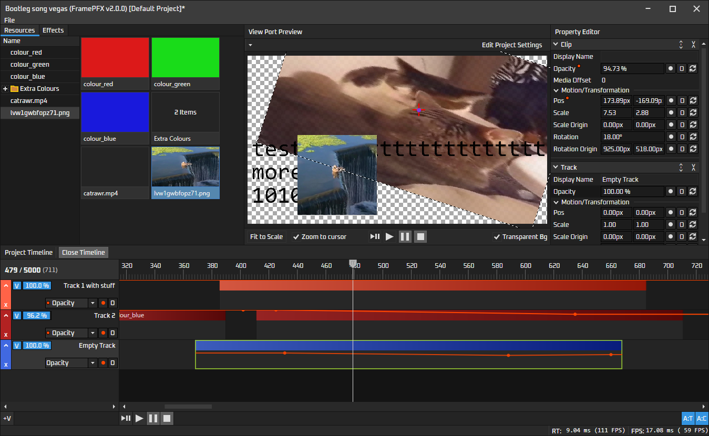
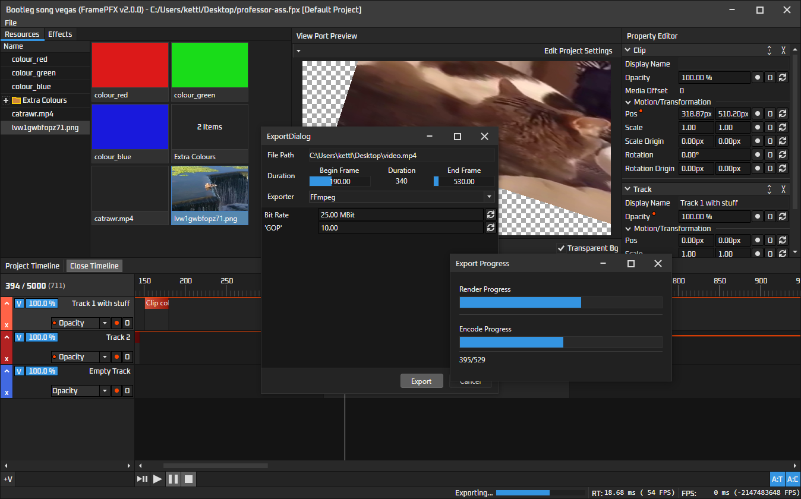

# FramePFX
A small (non-linear) video editor, written in C# using Avalonia for the UI

I mainly started this as a learning tool into the world of video/audio processing (all I really knew before this was basic OpenGL drawing), but also because other editors like vegas, premiere pro, hitfilm, etc, just seem to run so slowly and some of them just lack basic features (e.g zoom in the view port with CTRL + MouseWheel)

I doubt this will ever even come close to those editors, but hopefully it will at least support some basic editing

If you have any feedback/criticism for the app, that would be appreciate! Also feel free to contribute, if you would like to. You can see the TODO list near the bottom

# Downloading and Compiling/Building

To compile and run the editor, you need to download FFmpeg yourself. You can find the download link here: https://github.com/BtbN/FFmpeg-Builds/releases/download/latest/ffmpeg-master-latest-win64-gpl-shared.zip

### FramePFX assumes everything is 64 bit --- x86/32-bit/AnyCPU most likely won't work!
Create a folder called `libraries` in the solution folder and a sub-folders called `ffmpeg`.
Copy the contents of both of the ffmpeg archive into that folder. You should be able to navigate
to `\FramePFX\libraries\ffmpeg\lib`.

If you only plan on debugging only from VS/Rider or whatever IDE you use, it works fine as long as
the ffmpeg folder is in the 'libraries' folder. If you associated the `fpfx` file extension with FramePFX
in the build folders, then you most likely will need to copy the DLL files in ffmpeg's `bin` folder
(except for the .exe files) into the same folder as `FramePFX.exe`

Hopefully then you should be able to build and run without issue. This project uses Avalonia 11.2.2 and .NET 8 (C# 12)

### Possible build problems
Sometimes, the SkiaSharp nuget library doesn't copy the skia library files to the bin folder when you clone this repo and built. There are 2 fixes I found:
- Copy `\packages\SkiaSharp.2.88.7\runtimes\win-x64\native\libSkiaSharp.dll` into the editor's bin folder.
- Or, delete the `packages` folder in the solution dir, then right-click the solution in visual studio and click "Clean Solution", then click Restore Nuget Packages, then rebuild all.
  If none of these work, try uninstalling SkiaSharp in the nuget manager and then reinstalling. If that still does not work, then I really don't know what's going on...

# Preview

This is the latest version using Avalonia:

Here is a preview of the export process. Export button is in File>Export, you specify a path and then click Export.
To cancel the render you just click Cancel on the dialog behind the export progress window

The grey panel below "Exporter: FFmpeg" is encoder-specific details

## Resource list
The resources are shareable between clips, so that clips can obviously share similar details (e.g. same text or font/font size), or same image, same shape colour, etc.

To drag videos, images, etc., into the editor: drag and drop the file to the top left "resource manager panel", and then drag one of those items into the timeline

This system is still quite janky and, if anything, too flexible; added complexity for limiting the max number of resources referencable, and handling that error case

# TODO
### Avalonia Remake:
- Implement project settings dialog
- Implement UI for Effects list that can be dropped into a clip/track
### Audio
I removed audio playback from the Avalonia remake because it required PortAudio, requiring a native project, both of which were a hassle to auto-compile. Check out the last WPF release for the issues on it though; it wasn't great
### Automation Engine
- Add support for smooth interpolation (e.g. a curve between 2 key frames). I tried doing this, but had a hard time figuring out the math to do the interpolation, and also doing the hit testing for the UI
### Clips
- AVMediaVideoClip is extremely slow for large resolution videos (e.g. 4K takes around 40ms to decode and render onscreen), and only a few video codecs even seem to work. Lots of common file formats give an error like "found invalid 
  data while decoding". I don't know FFmpeg much but I hope to somehow fix this at some point
- Implement fading between 2 clips
### History system
- There's no undo functionality yet. I might try and implement this once I implement a few of the other features like audio and maybe hardware accelerated final-frame assembly in the renderer
### Bugs to fix
- Importing certain video files can cause the render to fail (some sort of "found invalid data while decoding" error)

## Contributing
Feel free to contribute whatever you want if you think it'll make the editor better!
The code base isn't perfect so feel free to help try and standardize things

# Licence
All source files in FramePFX are under the GNU General Public License version 3.0 or later (GPL v3.0+).
FramePFX uses libraries that have other licences, such as MIT/LGPL licences.

If any source file is missing a copyright notice, it is assumed to be licenced under the same
licence as FramePFX

Currently, the used LGPL parts are:
- FFmpeg.AutoGen, which is licenced under the GNU Lesser General Public License version 3.0 (LGPL v3.0)
- FFmpeg
