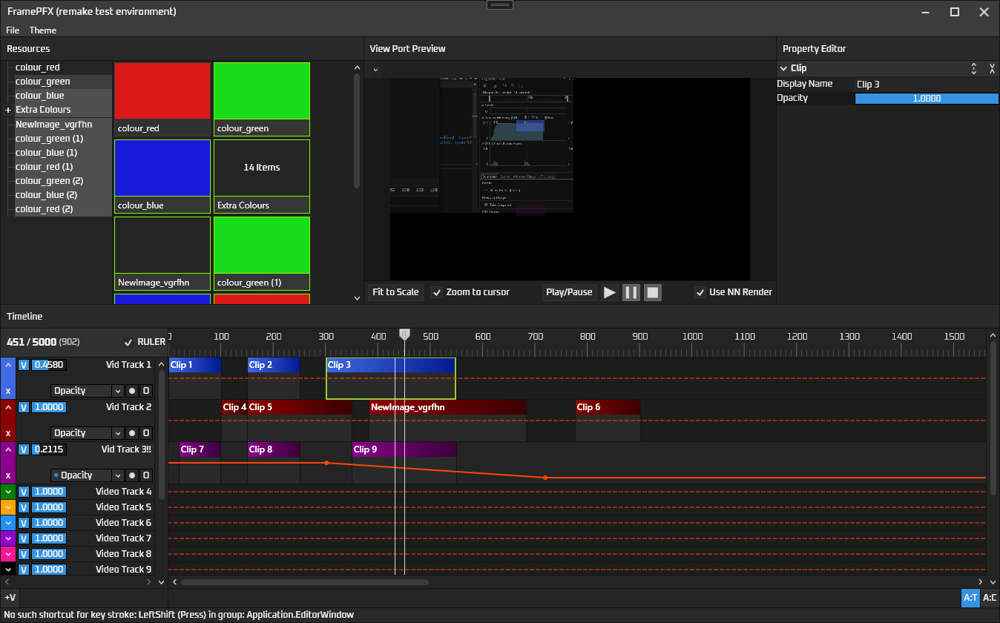

# FramePFX
A small (non-linear) video editor, written in C# using WPF

I mainly started this as a learning tool into the world of video/audio processing (all I really knew before this was basic OpenGL drawing), but also because other editors like vegas, premiere pro, hitfilm, etc, just seem to run so slowly and some of them just lack basic features (e.g zoom in the view port with CTRL + MouseWheel)

I doubt this will ever even come close to those editors, but hopefully it will at least support some basic editing

If you have any feedback/criticism for the app, that would be appreciate! Also feel free to contribute, if you would like to. You can see the TODO list near the bottom

# Preview
There are 6 themes. This is the `Soft Dark` theme. But there's also `Deep dark`, `Dark Grey`, `Grey`, `Red and Black` and a really bad `Light Theme`

### Automation/animation
Always found automating parameters in the standard editors to be generally finicky. Ableton Live has a really good automation editor though, so I took a fair bit of inspiration from it:
- Each clip has it's own keyframe/envelope editor that stretches the entirety of the clip. 
- Tracks have the same, but it stretches the entire timeline. 
- Automating project settings, or anything else really, will soon be do-able on a timeline automation specific track (allowing for more than just video/audio tracks)

# Backend stuff

### Models and the UI

I previously made this using MVVM everywhere, but it made adding new changes really difficult, so I decided to go with a
mostly non-view-model design, where the models are just the state and the views add/remove event handlers for those methods

This turns out to be a lot more performant, somewhat just as easy to add new features, and the signals between ViewModel/View not
being entirely commands. But it does mean moving this to something like Avalonia (which I haven't thought of doing yet) would be a lot
more difficult.

The editor can run entirely without a front end though, as none of the models contain any UI specific code (except a selection state in the
clips, tracks and resources, but they're just booleans)

### Rendering
Rendering uses SkiaSharp (for simplicity) and multiple render threads for speed. The `RenderManager` class handles the render initialisation.

The render phase is like this:
- Something tells the RenderManager that the render state is invalidated and to schedule a render on the app dispatcher
- All timeline tracks processed (bottom to top, as most editors do) to figure out if the track can be rendered (is it visible 
  and a non-zero opacity and are there clips on the playhead that are visible)
- `PrepareRenderFrame` is called on the video tracks, which then calls `PrepareRenderFrame` on the clip being rendered. That method is used to
  generate rendering proxy data, such as the opacity of the clip at the current point in time
- A task is started, and that task calls the tracks' `RenderFrame` method, which calls the clips' `RenderFrame` method, which uses that proxy data (generated in the preparation phase)
  to actually draw pixels into the track's `SKSurface`
- Once all tracks have been rendered, the final frame is assembled from each track's `SKSurface` (on the rendering thread as well)
- The final frame is now completed, `FrameRendered` is fired in the render manager, and the view port hooks onto that event and draws the rendered frame

### Resource list
The resources are shareable between clips, so that clips can obviously share similar details (e.g. same text or font/font size), or same image, same shape colour, etc.

To drag videos, images, etc., into the editor: drag and drop the file to the top left "resource manager", and then drag one of those items into the timeline. Will soon support directly dropping a clip into the timeline

# TODO
### Audio
I don't know how to implement audio playback yet, despite my best efforts to try and understand audio playback and how data is requested/delivered at the right times. I found a demo of libsoundio, which is in App.cs at the moment, but that's about it really
### Automation Engine
- Add support for smooth interpolation (e.g. a curve between 2 key frames). I tried doing this, but had a hard time figuring out the math to do the interpolation, and also doing the hit testing for the UI
### Timelines, Tracks
- Video tracks do support effects but they aren't processed yet
### Clips
- *[From old editor version]* AVMediaVideoClip is extremely slow for large resolution videos (e.g. 4K takes around 40ms to decode and render onscreen), and only a few video codecs even seem to work. Lots of common file formats give an error like "found invalid 
  data while decoding". I don't know FFmpeg much but I hope to somehow fix this at some point
- Implement fading between 2 clips
### Resources
- Implement an automatic resource loader, that auto-loads stuff like images, videos, etc., and shows a window specifying any
  errors encountered and allowing you to fix those errors
### History system
- There's no undo functionality yet

# Building

At the moment, FFmpeg isn't used (as I have to reimplement the export system since I rewrote the entire app). However,
you would just need FFmpeg's shared x64 libraries. They can be found here: 
https://github.com/BtbN/FFmpeg-Builds/releases/download/latest/ffmpeg-master-latest-win64-gpl-shared.zip

You build the project (debug or release), then place all of the FFmpeg DLL files in the bin folder (usually `<solution>\FramePFX\bin\x64\Debug`), and then you should be able to run the editor, and debug it if you want. 

The project uses .NET Framework 4.8, so you will need that installed

### Possible build problems
Sometimes, the SkiaSharp nuget library doesn't copy the skia library files to the bin folder, so you need to do that manually:
Copy `\packages\SkiaSharp.2.88.7\runtimes\win-x64\native\libSkiaSharp.dll` to the bin folder

## BUGS
- *[From old editor version]* Importing certain video files can cause the render to fail (some sort of "found invalid data while decoding" error)

## Licence
Project is licenced under MIT. I'm not a lawyer but, AFAIK, FFmpeg and FFmpeg.AutoGen being licenced primarily under GNU Lesser General Public License allows MIT to be used as long as the FFmpeg source code is not modified (which in this project, it isn't)
