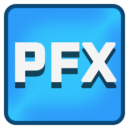

    
    
FramePFX

FramePFX is a small, open source, non-linear video editor, written in C# using Avalonia for the UI.

# Previews

This is the latest version using Avalonia:

Here is a preview of the export process. Export button is in File>Export, you specify a path and then click Export.
To cancel the render you just click Cancel on the dialog behind the export progress window

The grey panel below "Exporter: FFmpeg" is encoder-specific details

# Building
FramePFX assumes everything is 64 bit --- x86/32-bit/AnyCPU won't work properly!

All of the native projects are automatically downloaded and compiled when you 
first build the C# projects, however,  FFmpeg needs to be downloaded separately. 
Here is the specific version that works currently (windows only): 
https://github.com/BtbN/FFmpeg-Builds/releases/download/autobuild-2024-12-11-13-02/ffmpeg-N-118048-g1e76bd2f39-win64-gpl-shared.zip

### Instructions

- Clone the project: `git clone --recursive https://github.com/AngryCarrot789/FramePFX`
- Create a folder called `ffmpeg` in the solution folder. 
- From the downloaded ffmpeg archive, copy everything (the 4 dirs and the LICENCE.txt) into that new ffmpeg folder

There should be 8 DLL files in `\FramePFX\ffmpeg\bin`, and one of them should be avcodec-61.dll. If it's not 61 you have the wrong version of FFmpeg.
You can delete the EXE files if you want, since they aren't used

- Open FramePFX.sln. You will get an error about projects not being loaded; Ignore it. Now build the solution by going to the `Build` menu and clicking `Build Solution` 

Hopefully then you should be able to run and modify any of the 3 FramePFX projects without issue. This project uses Avalonia 11.2.2 and .NET 8 (C# 12)

### Windows only commands

The projects in the solution use windows commands like mkdir and xcopy, which may not work on other platforms.
Feel free to create a pull request on a more cross-platform solution!

The 8 DLLs just have to be in the same directly as the FramePFX-DesktopUI.exe executable

### Possible build problems
Sometimes, the SkiaSharp nuget library doesn't copy the skia library files to the bin folder when you clone this repo and built. There are 2 fixes I found:
- Copy `\packages\SkiaSharp.2.88.7\runtimes\win-x64\native\libSkiaSharp.dll` into the editor's bin folder.
- Or, delete the `packages` folder in the solution dir, then right-click the solution in visual studio and click "Clean Solution", then click Restore Nuget Packages, then rebuild all.
  If none of these work, try uninstalling SkiaSharp in the nuget manager and then reinstalling. If that still does not work, then I really don't know what's going on...

# TODO
### Avalonia Remake:
- Implement UI for Effects list that can be dropped into a clip/track
### Rendering Engine
- While we have access to port-audio, I think the entire rendering engine needs an overhaul. 
  Previously, rendering audio by extracting an exact number of bytes from a clip based on the
  project frame rate. However, this results in a lot of crackling since the playback FPS isn't pinpoint accurate

  Rendering video too needs to be redone, since the view port is typically quite small, but we are rendering full-sized video 
  frames of each clip and then just scaling down. This isn't so bad for, say, rectangles and basic primitive shapes. 
  However, rendering a 4K video frame from an MP4 file is a long and nasty task, then scaling down to 1080p (or whatever the MediaScale of the clip is) 
  and then finally down to the viewport (typically around the 500x300 size) in the end is just hugely wasteful, so we need either RenderFull and 
  RenderPreview methods, or, a new rendering system. The current technique of async-rendering doesn't seem so bad. 
### Automation Engine
- Add support for smooth interpolation (e.g. a curve between 2 key frames). I tried doing this, but had a hard time figuring out the math to do the interpolation, and also doing the hit testing for the UI
### Clips
- AVMediaVideoClip is extremely slow for large resolution videos (e.g. 4K takes around 40ms to decode and render onscreen), 
  and only a few video codecs even seem to work. Lots of common file formats give an error like "found invalid 
  data while decoding". I don't know FFmpeg much but I hope to somehow fix this at some point
- Implement fading between 2 clips
### History system
- There's no undo functionality yet. I might try and implement this once I implement a few of the other features like audio and maybe hardware accelerated final-frame assembly in the renderer
### Bugs to fix
- Importing certain video files can cause the render to fail (some sort of "found invalid data while decoding" error)
### Multi-thread synchronisation
- We need to create locks to make accessing and modifying the application state safer, especially now that the activity system works. 
 
  Maybe an application-wide lock for writing into the state of the models? This is similar to how IntelliJ IDEA works; a mostly-read, read-write lock. 
  Write locks are only acquirable on the main thread (we use the dispatcher to get on there), but any thread can take the read lock. Taking the 
  read lock requires blocking until no write operations are left, and taking the write-lock requires blocking until all readers are done (and 
  there's also an event fired when trying to acquire the write lock, to let readers cancel their operations to avoid freezing the UI)

## Contributing
Contributions are welcomed with open arms! Just create a pull request, or an issue then PR, whichever you fancy. 
You can find information on how to compile and run/debug the app if you scroll up a bit.
The TODO list is above, but you can also just search `// TODO:` in the code base

You can find detailed explanations in the docs folder, which explains the core parts of the editor (such as the
commands, automation, etc.). There's still lots to be documented so it doesn't explain everything

The code base isn't perfect so feel free to help try and standardize things!

# Licence
All source files in FramePFX are under the GNU General Public License version 3.0 or later (GPL v3.0+).
FramePFX uses libraries that have other licences, such as MIT/LGPL licences.

If any source file is missing a copyright notice, it is assumed to be licenced under the same
licence as FramePFX

Currently, the used LGPL parts are:
- FFmpeg.AutoGen, which is licenced under the GNU Lesser General Public License version 3.0 (LGPL v3.0)
- FFmpeg
